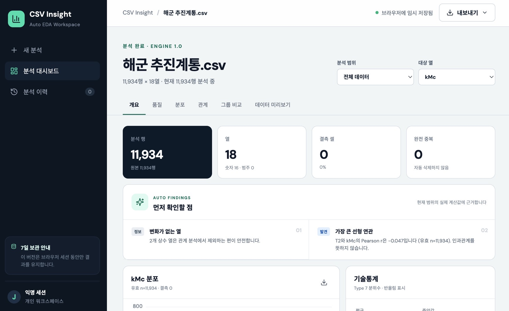
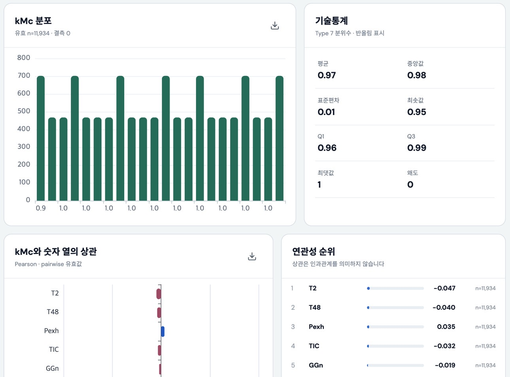

# CSV Insight

CSV·TSV 파일을 업로드하면 데이터 구조, 품질, 분포와 변수 간 관계를 자동으로 계산하고, 근거 수치가 연결된 한국어 분석 요약을 제공하는 탐색적 데이터 분석(EDA) 웹앱입니다.

기술 명세서는 [`docs/SPEC.md`](docs/SPEC.md)에 보존되어 있으며, 현재 버전은 서버나 계정 없이 로컬에서 바로 검증할 수 있도록 브라우저 내 분석 엔진으로 구현했습니다.

## 이번 작업의 주요 내용

### 데이터 입력과 형식 확인

- CSV·TSV 파일 선택 및 드래그 앤 드롭
- 쉼표, 세미콜론, 탭 구분자 자동 감지
- UTF-8 BOM 제거 및 완전히 빈 행 제외
- 중복·빈 헤더에 안정적인 표시 이름 부여
- 3.5MB, 20,000행, 500열, 2,000,000셀 제한 검증
- 분석 전 첫 20행, 구분자, 인코딩과 추천 대상 열 확인

### 자동 EDA

- 숫자형, 이진형, 범주형, 식별자, 상수 및 전체 결측 열 분류
- 결측 셀, 완전 중복 행, 고유값과 상수 열 진단
- 유효 표본 수, 평균, 중앙값, 표본 표준편차(`ddof=1`), 최솟값·최댓값 계산
- Type 7 방식의 Q1·Q3·p5·p95 분위수 계산
- 보정 표본 왜도와 `1.5 × IQR` 이상치 후보 계산
- Pearson 상관계수와 변수별 유효 pair 수 제공
- 실제 계산 결과를 인용하는 한국어 자동 발견 제공
- 이상치와 중복을 자동 삭제하지 않고 확인 대상으로 표시

### 탐색과 비교

- 전체 데이터, 첫 100행, `seed=42` 무작위 100행 비교
- 대상 열 변경과 낮은 고유값 열의 그룹 필터
- 히스토그램·범주 막대그래프·연관성 순위 시각화
- 개요, 품질, 분포, 관계, 그룹 비교, 데이터 미리보기 탭
- 차트와 요약에 현재 분석 범위·유효 표본·결측 수 표시

### 샘플과 결과 내보내기

- Mercedes-Benz 제조 데이터: 4,209행 × 378열
- UCI 해군 추진계통 데이터: 11,934행 × 18열
- UCI 와인 통합 데이터: 6,497행 × 13열
- JSON·CSV·Markdown 분석 결과 다운로드
- 개별 차트 PNG 저장

### 사용자 경험

- 한국어 중심의 반응형 대시보드
- 데스크톱·모바일 레이아웃 지원
- 키보드 접근 가능한 표와 명시적인 상태 라벨
- 실제 작업 화면을 첫 화면으로 사용하는 분석 워크스페이스 구성

### 브라우저 임시 저장과 분석 이력

- IndexedDB에 원본 데이터와 대상 열·분석 범위·그룹 필터 설정 저장
- 새 데이터를 분석해도 이전 결과를 분석 이력에서 다시 열기
- 최근 분석 최대 5개, 마지막 사용 시점부터 7일 보관
- 분석 설정 변경 시 자동 갱신 및 저장 상태 표시
- 개별 이력 삭제와 만료 데이터 자동 정리
- 모든 데이터는 현재 브라우저에만 저장되며 서버로 전송하지 않음

## 오류 수정 사항

- 고유값 비율이 높은 일반 숫자 열까지 식별자로 분류되던 문제를 수정했습니다. 이제 `ID`, `index`, `uuid`처럼 명시적인 이름을 가진 열만 기본 식별자로 분류하므로, 연속형 대상 열의 기술통계와 상관계수가 정상 계산됩니다.
- `String.replaceAll()`과 `Array.at()` 사용 시 발생하던 TypeScript 컴파일 오류를 해결하기 위해 앱의 컴파일 대상을 ES2022로 조정했습니다.
- Node 설정 프로젝트가 `vite.config.js`와 선언 파일을 생성하던 문제를 `noEmit` 설정으로 막았습니다.
- 빌드 결과, 의존성, TypeScript 캐시와 환경변수 파일이 저장소에 포함되지 않도록 `.gitignore`를 보완했습니다.
- 숫자 `0`을 결측으로 처리하지 않도록 파싱·프로파일링 규칙을 검증했습니다.
- 열 수가 다른 CSV 행을 조용히 자르지 않고 오류로 알리도록 처리했습니다.
- 대상 열 통계에서 Type 7 분위수와 표본 표준편차가 올바르게 계산되는지 회귀 테스트를 추가했습니다.
- 완전 중복 행을 삭제하지 않은 상태에서 정확히 집계하는 테스트를 추가했습니다.

## 검증 결과

- 와인 통합 샘플: 6,497행 × 13열
- 와인 완전 중복: 1,177행
- `quality`–`alcohol` Pearson 상관계수: 약 `0.444`
- 해군 샘플: 11,934행 × 18열
- 자동화 테스트: 4개 통과
- TypeScript 검사 및 Vite 프로덕션 빌드 통과
- IndexedDB 보관 정책 회귀 테스트 통과
- 로컬 개발 서버: `http://localhost:5173`

## 로컬 실행

Node.js 20 이상을 권장합니다.

```bash
npm install
npm run dev
```

브라우저에서 [http://localhost:5173](http://localhost:5173)을 엽니다.

## 테스트와 빌드

```bash
npm test
npm run build
```

빌드 결과는 `dist/`에 생성됩니다. Vercel에서는 Vite 프리셋, 빌드 명령 `npm run build`, 출력 디렉터리 `dist`를 사용하면 됩니다. 이번 작업에서는 Vercel 배포를 실행하지 않았습니다.

## 프로젝트 구조

```text
src/
  App.tsx             # 업로드, 형식 확인, 대시보드와 내보내기 UI
  lib/eda.ts          # 파싱, 자료형 추론, 통계와 상관 분석 엔진
  lib/eda.test.ts     # 핵심 계산 회귀 테스트
  lib/storage.ts      # IndexedDB 분석 이력과 7일 보관 정책
  lib/storage.test.ts # 보관 만료·최근 5개 유지 테스트
  styles.css          # 반응형 시각 디자인
public/
  samples/            # 벤츠·해군·와인 샘플 데이터
docs/
  SPEC.md             # 전체 제품·운영 기술 명세
  screenshots/        # README 화면 이미지
```

## 현재 범위와 다음 단계

현재 버전은 로컬 검증과 제품 흐름 확인을 위한 브라우저 기반 MVP입니다. 기술 명세의 운영 단계에서는 다음 항목을 서버 기능으로 확장합니다.

- Vercel Node.js Functions 기반 서버 파싱·통계 API
- Neon PostgreSQL 데이터셋·분석 결과 저장
- 익명 세션, CSRF 검증, 사용량 제한과 7일 보존
- 저장된 분석 이력 다시 열기·삭제
- 서버 기준 JSON·CSV·Markdown 내보내기

OpenAI API는 기본 EDA에 필요하지 않으며, 향후 선택형 해석 기능의 확장 지점으로만 계획되어 있습니다.

## 데이터 출처

- Mercedes-Benz Greener Manufacturing — Kaggle competition dataset
- Condition Based Maintenance of Naval Propulsion Plants — UCI Machine Learning Repository 316
- Wine Quality — UCI Machine Learning Repository 186

샘플을 공개 서비스에서 재배포하기 전에는 각 원 출처의 최신 이용 조건을 다시 확인해야 합니다.
